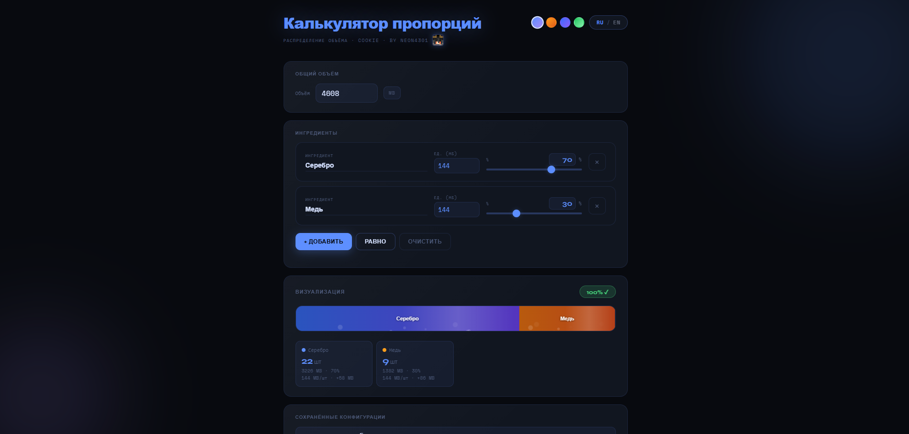

# Proportion Calculator for TFG

Одностраничный калькулятор пропорций для Minecraft сервера TFG.

## ✨ Возможности

* Расчёт процентов и объёма
* Визуальная шкала распределения
* Анимированные сегменты
* Сохранение конфигураций
* Поддержка нескольких тем
* RU / EN локализация
* Адаптивный интерфейс
* Поддержка мобильных устройств
* Загрузка Minecraft головы через API

---

## 📦 Технологии

* HTML5
* CSS3
* Vanilla JavaScript
* LocalStorage
* Crafatar API

---

## 🖼 Скриншоты

Добавьте сюда скриншоты интерфейса.

```md

```

---

## 🚀 Запуск

Просто откройте `index.html` в браузере.

Либо используйте локальный сервер:

```bash
python -m http.server
```

---

## ⚙️ Функции

### Калькулятор ингредиентов

Позволяет:

* задавать процент
* задавать размер единицы
* автоматически считать количество предметов
* распределять проценты равномерно

### Визуализация

* плавная анимация
* bubble/shimmer эффекты
* интерактивные подсказки

### Сохранения

Конфигурации сохраняются через LocalStorage.

---

## 🎨 Темы

Доступны:

* Obsidian
* Forge
* Arctic
* Poison

---

## 📱 Mobile Support

Интерфейс адаптирован под:

* телефоны
* планшеты
* ПК

---

## 👤 Автор

Made by Neon4301

Minecraft skin avatar powered by Crafatar.

---

## 📄 License

MIT License
